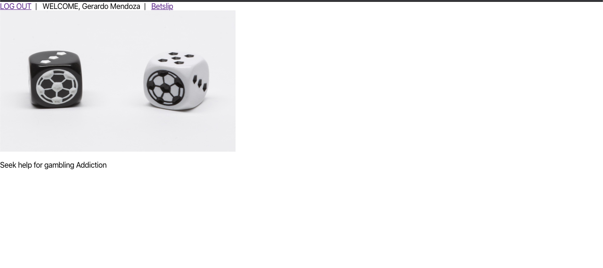
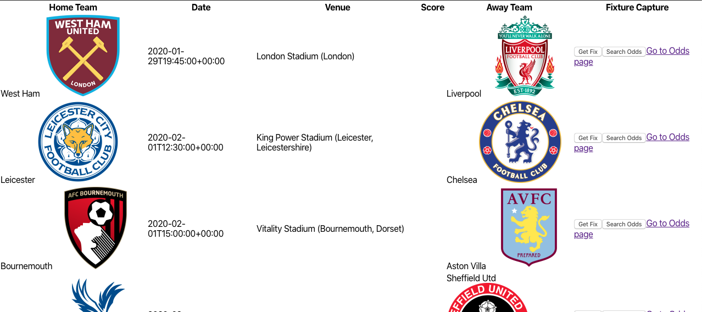

# [**Gamblin Man**](https://gamblin-man.herokuapp.com/)
###  **Contents**
1. [Description](#desc)
2. [Getting Started](#start)
3. [User Experience](#ui) 
4. [Tech](#tech)
5. [Unresolved issues](#issues)
6. [Future Enhancements](#stretch)
##  **Description**
________________
A web application to display and aggregate betting odds and suggestions for the outcomes of future soccer matches.
[top](#home)
##  **Getting Started**
________________
[LINK TO TRELLO](https://trello.com/b/nNWp8Rs4/gamblinman)
[top](#home)
##  **User Experience**
________________
AAU, I want see a landing page to logon
AAU, I want to login and search for fixtures
AAu, I want to see the odds for those fixtures
AAU, I want save individual fixtures and my score predictions

**Landing**

**Matches**

[top](#home)
##  **Tech**
________________
* MongoDB/Mongoose
* Express
* React
* Node
* API-Football API
[top](#home)
##  **Unresolved Issues**
________________
* Need the function to post to my API to pass through
* Need to deal with fixtures with no odds posted yet
* Need to style better
* Get save odds to display

[top](#home)
##  **Future Enhancements**
________________
* Add some data processing to all the available betting odds
* Add date visualization to provide feed back on betting habits
[top](#home)